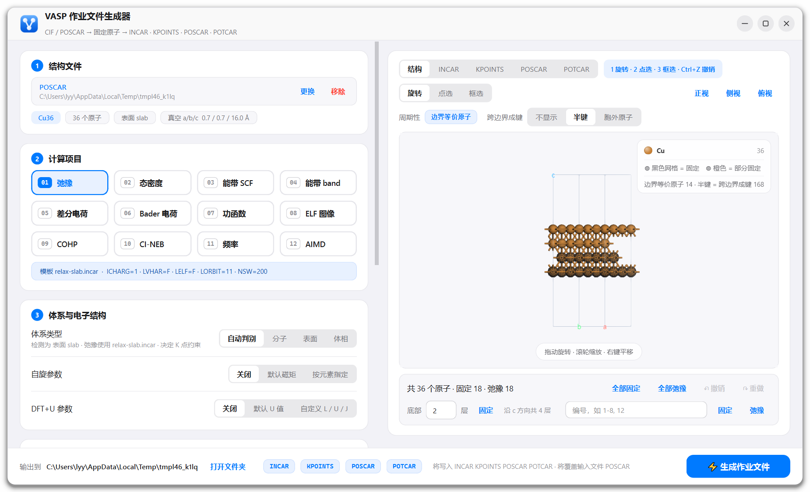
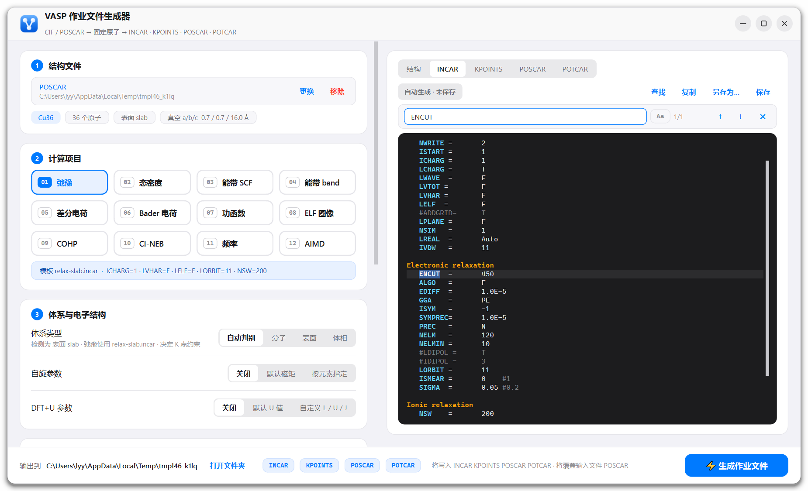

<div align="center">


# Generate-VASP

**VASP 作业输入文件生成器** · CIF / POSCAR → 固定原子 → INCAR · KPOINTS · POSCAR · POTCAR

[](https://github.com/moyulyy/Generate-vasp/releases/latest)


[](LICENSE)

[下载便携版](https://github.com/moyulyy/Generate-vasp/releases/latest) · [快速开始](#快速开始) · [使用流程](#使用流程) · [命令行脚本](#命令行脚本)

</div>



## 功能亮点

| | |
| --- | --- |
| 🧪 **12 个计算项目** | 弛豫、DOS、能带（SCF + 路径）、差分电荷、Bader、功函数、ELF、COHP、CI-NEB、频率、AIMD，按体系类型自动选模板 |
| 🧊 **3D 固定原子** | 3Dmol.js 视图中点选 / 框选固定，按层或编号批量操作，支持撤销重做，周期像与跨边界成键可视化 |
| 🧲 **自旋与 DFT+U** | 启发式、LLM 工具调用或按元素指定 MAGMOM；内置 U 值表或自定义 L / U / J |
| 📐 **K 点与赝势** | Γ 网格按密度生成，能带走 seekpath / 二维点阵路径；赝势按库内变体选择并检查 ENCUT |
| ⚙️ **计算条件** | 隐式溶剂化、电场、恒电势 CP-VASP、并行参数、电荷混合、细 FFT 网格，以及 lobsterin、OPTCELL |
| ✍️ **可编辑输出** | 每个文件都是带高亮与查找的编辑器；手动修改会保留，之后改动的选项仍会合并进来 |

项目由三部分组成：

- **`gui/`**：桌面图形界面（PySide6 + 3Dmol.js），日常使用的主入口。
- **`script/`**：可单独在命令行使用的参数脚本，GUI 也直接调用它们。
- **`IncarTemplates/`、`ConditionsTemplates/`**：INCAR 模板与附加条件模板，改模板即可改变生成结果。

## 快速开始

### 方式一：便携版（Windows，免安装）

1. 在 [Releases](https://github.com/moyulyy/Generate-vasp/releases/latest) 下载 `Generate-VASP-<版本>-win64.zip`，解压到任意目录。
2. 双击 `Generate-VASP.exe`。无需安装 Python，设置保存在同目录的 `settings.ini`，不写注册表。
3. 把赝势库放进 `POTCAR/` 文件夹（`POTCAR/标签/POTCAR`），或在界面中指向已有的赝势库。
4. 需要 LLM 自旋分析时，见 [LLM 配置](#llm-配置)。

便携版目录中的 `IncarTemplates/`、`ConditionsTemplates/` 与 `script/` 都可以直接修改，重启后生效。

### 方式二：从源码运行

需要 Python ≥ 3.9（已在 3.11 与 3.14 上测试）。

```bash
git clone https://github.com/moyulyy/Generate-vasp.git
cd Generate-vasp
pip install -r gui/requirements.txt
python gui/incar_gui.py              # 空白启动
python gui/incar_gui.py POSCAR       # 直接打开结构文件
```

| 依赖 | 用途 |
| --- | --- |
| `PySide6` | 界面与内置浏览器内核（3D 视图用到 QtWebEngine，完整的 `PySide6` 包已包含） |
| `numpy`、`ase` | 结构读写、近邻成键、K 点与能带路径 |
| `spglib`（可选） | 能带路径按原胞给出 |
| `seekpath`（可选） | 体相能带使用 HPKOT 标准路径；未安装时回退 ASE |

Windows 下也可以：

- 双击 `gui/run.bat`：优先用 `pythonw` 启动，不弹出控制台窗口。它使用 PATH 中的 Python，conda 用户请在已激活环境的终端里运行，或改写其中的解释器路径。
- 在已激活的环境中运行 `powershell -ExecutionPolicy Bypass -File gui\create_shortcut.ps1`，会在桌面生成带图标的快捷方式。更换 Python 环境后重新运行即可。

赝势文件（POTCAR）受 VASP 许可约束，本项目不包含。需要自备赝势库，目录结构为 `赝势库/标签/POTCAR`（如 `POTCAR/Ni_pv/POTCAR`）。

### LLM 配置

「LLM 分析」自旋方式需要一个 OpenAI 兼容接口（DeepSeek、OpenAI 或其他中转服务均可）。连接信息只写在配置里，界面上不显示、也不能修改：

1. 把根目录（便携版为 exe 所在目录）的 `llm_config.example.json` 复制为 `llm_config.json`。
2. 填写 `api_key`、`base_url`、`model`：

```json
{
  "api_key": "sk-...",
  "base_url": "https://api.deepseek.com/v1",
  "model": "deepseek-chat"
}
```

也可以用环境变量 `LLM_API_KEY`、`LLM_BASE_URL`、`LLM_MODEL` 设置，环境变量优先。`llm_config.json` 已加入 `.gitignore`，不会被提交。

### 打包便携版

```bash
pip install pyinstaller pefile spglib seekpath
python packaging/build.py 1.0.0      # 输出 dist/Generate-VASP/ 与 dist/Generate-VASP-1.0.0-win64.zip
```

打包脚本会去掉用不到的 Qt 模块，把模板与脚本放到 exe 旁边，并检查压缩包中不含 `llm_config.json`。

## 使用流程

1. **结构文件**：点击或拖入 CIF / POSCAR / CONTCAR。CIF 会转换为 POSCAR。同种元素不连续时（常见于 CIF），会按元素首次出现的顺序重排，保证 POSCAR 与 POTCAR 一一对应。界面显示化学式、原子数、体系类型和 a/b/c 方向的真空间隙。
2. **计算项目**：选择 12 个项目之一（见下表），并按需设置体系类型、自旋、DFT+U、K 点密度、赝势和计算条件。
3. **固定原子**：在右侧「结构」页设置固定 / 弛豫，结果写进 POSCAR 的 `Selective dynamics`。
4. **检查与编辑**：在 INCAR / KPOINTS / POSCAR / POTCAR 页查看生成内容，可直接修改。
5. **生成**：点击「生成作业文件」（Ctrl+Enter）。文件写到结构文件所在目录，底部开关可选择写出哪些文件；开启 lobsterin / OPTCELL 后，它们也会出现在文件页和底部开关中。

### 计算项目

| 编号 | 项目 | INCAR 模板 | KPOINTS |
| --- | --- | --- | --- |
| 01 | 弛豫 | `relax-bulk` / `relax-slab` / `relax-mole`（按体系类型） | Γ 网格 |
| 02 | 态密度 | `dos` | Γ 网格 |
| 03 | 能带 SCF | `band-scf` | Γ 网格 |
| 04 | 能带 band | `band-band`（ICHARG=11，需先完成能带 SCF 并复制 CHGCAR） | 高对称路径 |
| 05 | 差分电荷 | `chargediff` | Γ 网格 |
| 06 | Bader 电荷 | `bader` | Γ 网格 |
| 07 | 功函数 | `workfunction`（含偶极修正，真空层应沿 c） | Γ 网格 |
| 08 | ELF 图像 | `elf` | Γ 网格 |
| 09 | COHP | `cohp` | Γ 网格 |
| 10 | CI-NEB | `neb`（IMAGES=3，各镜像目录需自行准备） | Γ 网格 |
| 11 | 频率 | `frequency`（只位移未固定的原子） | Γ 网格 |
| 12 | AIMD | `aimd` | Γ 网格 |

### 体系类型与 K 点

- **自动判别**：按晶胞各方向的真空间隙判断（阈值 5 Å）。三个方向都有真空为分子，只有一个方向有真空为表面，都没有为体相，其余情况按表面处理。也可以手动指定。
- **弛豫模板**：体相用 `relax-bulk`（ISIF=3），表面和分子用 `relax-slab` / `relax-mole`（ISIF=2）。
- **Γ 网格**：沿用 `mk-KPOINTS` 的规则，每个晶格方向取满足 `1 / (晶格长度 × k) ≤ 密度` 的最小 k，默认密度 0.04。分子固定为 1×1×1，表面在真空方向取 1。
- **能带路径**：表面使用二维点阵路径（要求真空沿 c），体相使用 seekpath 或 ASE。输入结构不是原胞时会提示。

### 电子结构、赝势与计算条件

- **自旋**：四种方式，结果都写成 ISPIN / MAGMOM。
  - 「启发式」：调用 `add-spin` 的内置规则，不联网，立即给出结果。add-spin 把它称作「回退」方案（即 LLM 不可用时的退路）。它对部分体系会拒绝给出结果（如磁序依赖超胞的 NiO），原因会显示在界面上。
  - 「LLM 分析」：调用 `add-spin` 的 LLM 工具调用流程，在后台运行，不阻塞界面。LLM 会先分析结构、查询元素与材料知识库，再提交方案，方案经 add-spin 校验后才写入。
    - 连接配置只来自配置，界面不显示也不能修改：API Key、接口地址、模型依次取环境变量 `LLM_API_KEY`（或 `OPENAI_API_KEY` / `DEEPSEEK_API_KEY`）、`LLM_BASE_URL`、`LLM_MODEL`，没有时取根目录的 `llm_config.json`（见 [LLM 配置](#llm-配置)）。错误信息中的接口地址、模型名与密钥会被隐去。
    - 「补充说明」会传给 LLM，例如已知价态或磁序。
    - 结果显示在补充说明下方的输出框中：MAGMOM、依据与告警。内容较长时在框内滚动。分析期间显示进度动画、当前轮次与已用时间，按钮变为「取消」。更换结构会自动取消正在进行的分析。
    - 调用失败时不会自动改用启发式，而是显示错误并禁止生成，需要重试或换一种方式。更换结构后需重新分析。
    - 网络：按系统 / 环境变量代理连接；代理端口无人监听（如代理软件未运行）时自动改为直连。接口返回 404 时会补上 `/v1` 再试。
  - 「按元素指定」：为每种元素填写初始磁矩。
- 数值输入框与下拉框不响应鼠标滚轮（滚轮只滚动页面），避免滚动时误改参数；请用键盘输入或方向键调整。
- **DFT+U**：「默认 U 值」使用 `add-u` 的内置表，「自定义」可按元素设置轨道、U、J。
- **电荷混合 / 细 FFT 网格**：开关分别对应 `ConditionsTemplates/parameters-MIX.incar`（AMIX、BMIX、AMIX_MAG、BMIX_MAG）与 `parameters-NGXF.incar`（NGXF、NGYF、NGZF）。开启后可修改各数值，模板中被注释的 NGXF 行会取消注释写入 INCAR。NGXF 通常取 NGX 的 2 倍，可参照同体系 OUTCAR 中的 NGXF 一行。
- **赝势**：赝势库路径可修改，并会被记住。每个元素可从下拉框选择赝势库中已有的变体（如 Ni、Ni_pv）。若 ENCUT 低于最大 ENMAX 的 1.3 倍会给出提示。
- **计算条件**：隐式溶剂化、电场、恒电势、并行参数，分别取自 `ConditionsTemplates/` 中的模板并追加到 INCAR。
  - 追加的参数与模板中已有参数同名时，模板中的那一行会被注释掉，INCAR 不会出现重复参数。
  - 开启恒电势时不再单独追加溶剂化参数，因为 CP-VASP 模板已包含。

### lobsterin（LOBSTER 成键分析）

在「计算条件」中开启后生成 `lobsterin`，以 `ConditionsTemplates/lobster.incar` 为模板。LOBSTER 只读取名为 `lobsterin` 的文件，所以文件名没有扩展名。

- **basisfunctions 自动设置**：按每个元素所用 POTCAR 的价电子数 ZVAL 推断价层。做法是从中性原子的最外层壳层向内累加电子，直到等于 ZVAL，计入的壳层就是基函数。例如 Ni → `3d 4s`，Ni_pv → `3p 3d 4s`，Fe_sv → `3s 3p 3d 4s`，Gd_3 → `5p 5d 6s`。
- **cohpbetween**：在输入框填写一组或多组原子对（编号从 1 开始，如 `37-38, 12-15`），每组生成一行 `cohpbetween atom A and atom B  orbitalwise`。界面会显示每对原子的元素与最小像距离，超过 4 Å 时提醒。原子对只对当前结构有效，更换结构后会清空。
- **POTCAR**：开启后自动去除 SHA256 / COPYR 行（LOBSTER 无法读取含这些行的 POTCAR），关闭后恢复原来的设置。
- **INCAR 检查**：若 INCAR 不满足 LOBSTER 的要求（LWAVE = .TRUE.、ISYM = 0 或 -1、NBANDS 不少于基函数总数），会给出提醒，并建议配合 09 COHP 项目使用。
- 生成后可在 lobsterin 页继续编辑，例如修改能量范围。

### OPTCELL（限定晶格方向弛豫）

只有在「01 弛豫」且体系为体相时才可开启，其余情况下开关不可用，也不会写出该文件。面板为 3×3 的 0/1 网格，三行依次对应 a、b、c 晶格矢量的 x、y、z 分量，1 表示该分量可变，0 表示固定，默认值取自 `ConditionsTemplates/OPTCELL.incar`。

- 写出的文件只含三行数字，模板中的 `## OPTCELL` 标题行不会写入。
- 需要使用编译了 OPTCELL 补丁的 VASP，且 ISIF = 3；INCAR 中 ISIF 不是 3 时会提醒。

### 3D 视图与固定原子

- **交互**：三种模式为旋转、点选（点击切换固定 / 弛豫）、框选（拖动固定，Shift + 拖动解除，会选中所有深度的原子）。悬停显示元素与编号，正视 / 侧视 / 俯视按晶胞方向对齐。
- **快捷操作**：固定底部 N 层（自动分层）、按编号固定或弛豫（如 `1-8, 12`）、全部固定、全部弛豫、撤销 / 重做。
- **标记**：完全固定的原子显示黑色网格，部分方向固定的显示橙色网格。
- **周期性显示**：
  - 「边界等价原子」：在晶胞面、棱、角处补上分数坐标 0 与 1 处的等价原子。
  - 「跨边界成键」有三种显示：不显示；半键（画到两原子中点，默认）；胞外原子（以浅色显示与胞内原子成键的周期像）。
  - 点击任何周期像，作用的都是对应的胞内原子。

### 编辑输入文件



各文件页都是编辑器（INCAR、KPOINTS、POSCAR、POTCAR，以及开启后的 lobsterin、OPTCELL），支持保存、另存为、复制、查找，并有语法高亮和当前行高亮。查找时会高亮全部匹配并显示序号，可区分大小写。每页顶部显示「自动生成 / 手动编辑」与「已保存 / 未保存」状态。

- **INCAR / KPOINTS / lobsterin / OPTCELL**：手动修改（包括已保存的修改）会被保留，之后在左侧改动的选项和计算条件仍会合并进来：手动改过的参数不受影响，选项涉及的参数按选项更新，同一参数以最后一次改动为准，关闭某项条件会删除对应的参数块。每次合并都可在编辑器内 Ctrl+Z 撤销；「恢复自动生成」放弃全部手动修改。当前设置无法自动生成时（如能带路径报错），以手动内容为准。
- **POSCAR**：修改后约 0.5 秒自动同步到 3D 视图，包括 T/F 标记。内容无法解析时会提示错误，并禁止生成。之后若在 3D 视图里改动固定状态，POSCAR 会按当前结构重新生成，手动加的格式与注释不会保留。
- **POTCAR**：只显示组成，每行一个赝势标签，并附 TITEL / ENMAX / ZVAL 注释，不显示赝势全文。修改标签（如 `Ni` → `Ni_pv`）后，会从赝势库重新拼接，并同步到左侧下拉框。标签与元素不符或库中不存在时会报错。
- 写出的 POSCAR 总是带 `Selective dynamics` 和逐原子 T/F 标记，没有固定原子时全为 T。

### 输出

- 所有文件写到结构文件所在目录，底部「打开文件夹」可直接打开该目录。
- 写入前若目标文件已存在，会询问是否覆盖。
- 如果输入文件本身就叫 `POSCAR`，生成时会被覆盖，界面会提前提示。

### 快捷键

| 快捷键 | 操作 |
| --- | --- |
| Ctrl+O | 打开结构文件 |
| Ctrl+S | 保存当前文件页（在「结构」页时为生成全部文件） |
| Ctrl+Enter | 生成作业文件 |
| Ctrl+F，F3 / Shift+F3 | 查找，下一个 / 上一个 |
| Ctrl+Z，Ctrl+Y | 撤销 / 重做固定操作（在编辑器内为文本撤销） |
| 1 / 2 / 3，Esc | 在 3D 视图中切换旋转 / 点选 / 框选，Esc 回到旋转 |

窗口为无边框弹窗样式：拖动标题栏移动，双击标题栏最大化，拖动边缘调整大小。赝势库路径、最近目录和周期性显示设置会被记住：源码运行时保存在注册表 `HKCU\Software\Generate-Input\incar-gui`，便携版保存在 exe 旁的 `settings.ini`。

## 命令行脚本

`script/` 下的脚本可以脱离 GUI 单独使用。`add-*` 系列默认把参数块追加到 INCAR 或打印到终端，`-d` 只打印不写入。

| 脚本 | 作用 | 说明 |
| --- | --- | --- |
| `add-spin/add-spin.py` | ISPIN / MAGMOM 初猜（结构分析 + 可选 LLM） | [README](script/add-spin/README.md) |
| `add-u/add-u.py` | DFT+U 参数（LDAU / LDAUL / LDAUU / LDAUJ） | `-l` 列出 U 值库 |
| `mk-KPOINTS/kpoint.py` | Γ 网格或能带路径 KPOINTS | [README](script/mk-KPOINTS/README.md) |
| `mk-POTCAR/mk_potcar.py` | 按元素顺序拼接 POTCAR | [README](script/mk-POTCAR/README.md) |
| `add-cp-vasp.py` | 恒电势参数，设置 TARGETMU | 见下 |
| `add-efield.py` | 电场参数，设置 EFIELD / IDIPOL | 见下 |
| `add-parallel.py` | 并行参数，设置 KPAR / NPAR | 见下 |

```bash
# 自旋与 DFT+U
python script/add-spin/add-spin.py POSCAR --no-llm --print
python script/add-u/add-u.py -p POSCAR -i INCAR -n          # 多候选时直接用默认值
python script/add-u/add-u.py -c Fe:2,2.8,1.2 -d             # 自定义 L,U,J，只打印

# K 点与赝势
python script/mk-KPOINTS/kpoint.py POSCAR --type slab -o KPOINTS
python script/mk-KPOINTS/kpoint.py POSCAR --mode lines --per-seg 30
python script/mk-POTCAR/mk_potcar.py POSCAR -o ./ --potcar-dir /path/to/POTCAR

# 恒电势：直接给 TARGETMU，或给电势 U (V vs SHE)，按 TARGETMU = 参考值 − U 换算
python script/add-cp-vasp.py -mu -4.5 -i INCAR
python script/add-cp-vasp.py -e 0.5 -ref -4.43 -i INCAR

# 电场：直接给 EFIELD (V/Å)，或给电压与厚度，按 EFIELD = −U / 厚度 换算；-dir 为 IDIPOL (1/2/3)
python script/add-efield.py -f -0.05 -dir 3 -i INCAR
python script/add-efield.py -u 0.3 -t 3.0 -i INCAR

# 并行：手动指定，或给核数（与 k 点数）自动选取
python script/add-parallel.py -kpar 4 -npar 8 -i INCAR
python script/add-parallel.py -n 64 -k 8 -d
```

`add-parallel.py -n` 的规则是：在 `KPAR × NPAR = 核数` 的因子对中，取两者最接近的一组，并要求 KPAR 不超过 k 点数。这只是经验做法，大体系请按实际测试调整。

## 目录结构

```
Generate-vasp/
├── gui/
│   ├── incar_gui.py         主窗口（入口）
│   ├── jobgen.py            INCAR / KPOINTS / POTCAR / OPTCELL 生成与 LLM 自旋调用，复用 script/ 中的脚本
│   ├── lobster.py           lobsterin 生成（按 POTCAR 价层推断 basisfunctions）
│   ├── structure.py         结构读写、Selective dynamics、周期像与成键
│   ├── editor.py            文件编辑器（高亮、查找）
│   ├── widgets.py, theme.py 界面控件与样式
│   ├── viewer.html/.js      3D 视图（本地 3Dmol-min.js，无需联网）
│   ├── camera_views.py      按晶胞方向的标准视图
│   ├── assets/app.ico       应用图标
│   ├── run.bat, create_shortcut.ps1
│   └── requirements.txt
├── script/                  命令行脚本（见上表）
├── IncarTemplates/          各计算项目的 INCAR 模板
├── ConditionsTemplates/     溶剂化、电场、恒电势、并行等附加参数模板
├── packaging/               便携版打包脚本（PyInstaller）
├── llm_config.example.json  LLM 连接配置示例（复制为 llm_config.json）
└── docs/                    README 截图
```

## 已知限制

- **生成内容仍需检查**：INCAR 参数全部来自模板，提交计算前请确认 ENCUT、EDIFF、ISMEAR 等是否适合你的体系。磁矩初猜也不代表磁基态，不同磁序需要分别计算比较。
- **CI-NEB**：只生成 INCAR / KPOINTS，00–04 各镜像目录的结构需要另外准备。
- **体相能带路径**：未安装 seekpath 时使用 ASE 给出的路径。
- **LLM 自旋分析**：需要联网和可用的 API Key，每次分析会产生调用费用；LLM 给出的方案同样只是初猜，需要比较不同磁序的总能。
- **lobsterin 基函数**：按 POTCAR 价层推断，相当于标准基组；需要更大基组（如加 4p 极化函数）时请在 lobsterin 页手动修改。
- **POSCAR 手动编辑**：在 3D 视图中修改固定状态会重新生成 POSCAR，手动加的注释与格式不会保留。

## 许可

[MIT](LICENSE)。赝势文件（POTCAR）受 VASP 许可约束，不随本项目分发。3D 视图使用 [3Dmol.js](https://3dmol.csb.pitt.edu/)（BSD 许可）。
